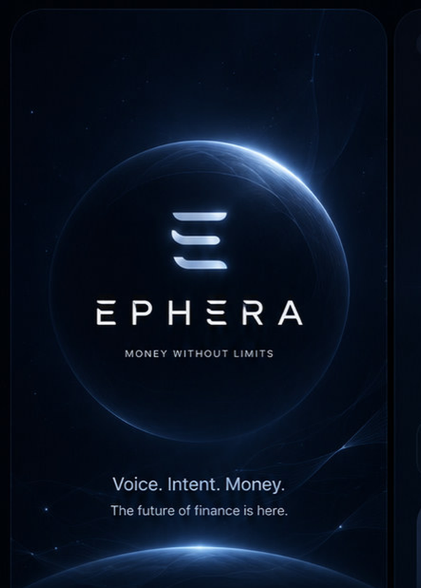
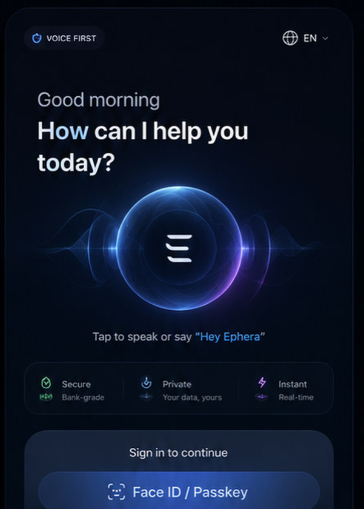
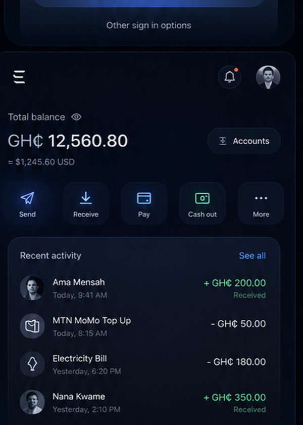
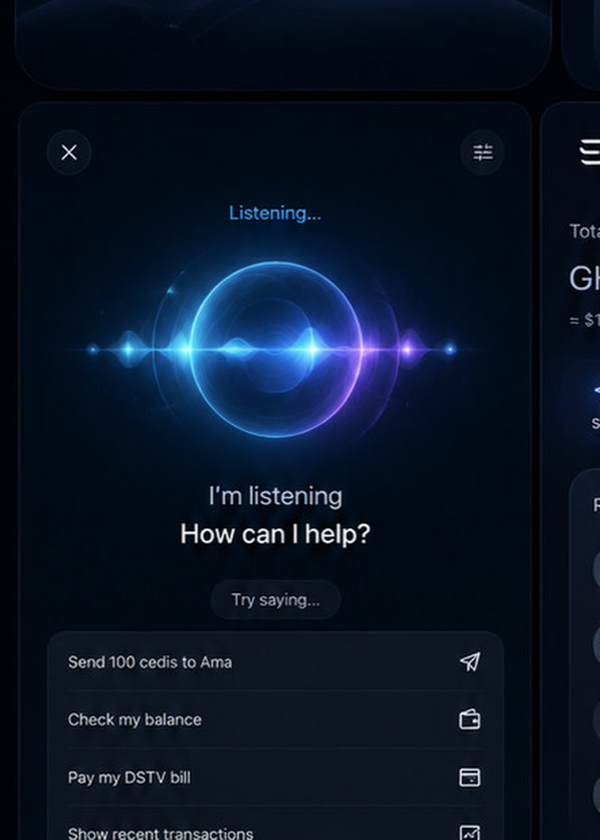
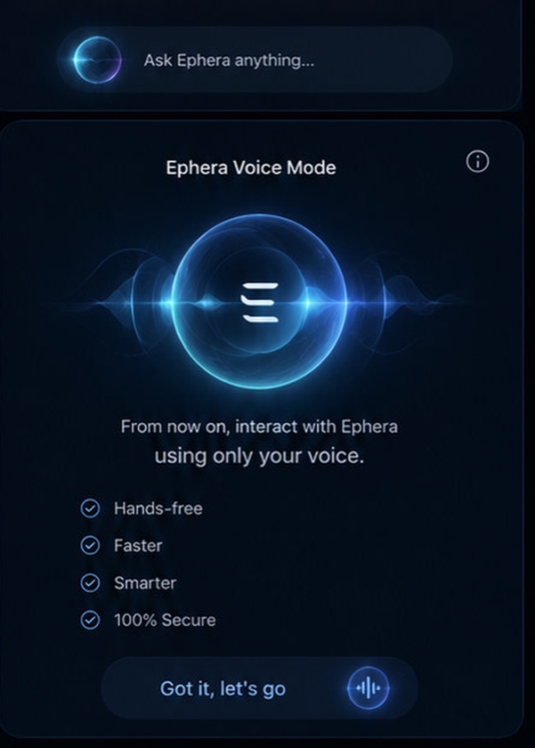
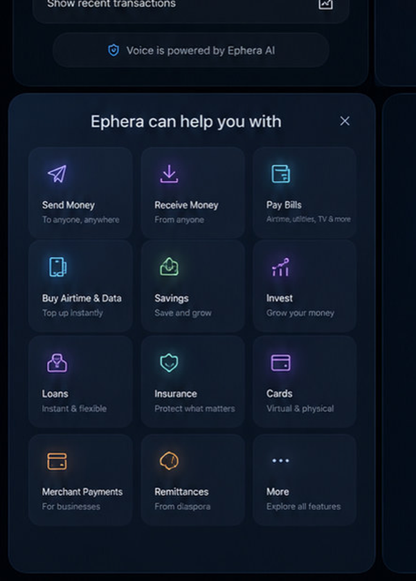
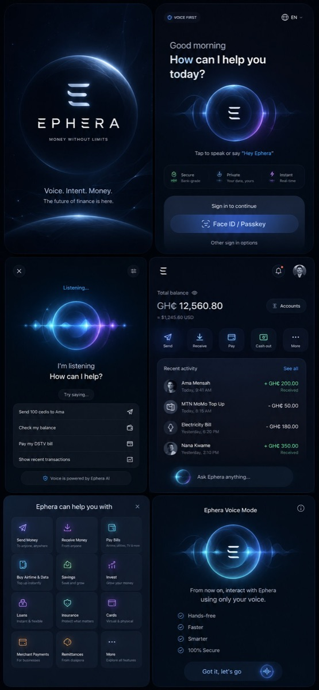

<p align="center">
  
</p>

<h1 align="center">EPHERA Money</h1>

<p align="center">
  <strong>Voice-native financial access for Africa and underserved markets</strong><br />
  Mobile money · banking · commerce · installable PWA · enterprise security
</p>

<p align="center">
  <a href="https://github.com/FrankAsanteVanLaarhoven/EPHERA-AI/actions/workflows/ci.yml"></a>
  
  
  
</p>

<p align="center">
  <a href="#product-overview">Product</a> ·
  <a href="#product-screenshots">Screenshots</a> ·
  <a href="#architecture">Architecture</a> ·
  <a href="#security--trust-model">Security</a> ·
  <a href="#getting-started">Getting started</a> ·
  <a href="#mobile--pwa-access">Mobile &amp; PWA</a> ·
  <a href="#roadmap">Roadmap</a>
</p>

---

## Description

**EPHERA Money** is an enterprise-grade, voice-native mobile-money and financial-access platform. Users state intent in natural language; the system compiles a precise financial instrument, shows cost and consequence, requires cryptographic authorisation, and posts only through an independent double-entry ledger.

> People should not have to understand banking applications, payment rails, or menu structures. They should state what they need, see the exact cost and consequence, approve it securely, and receive proof that it happened.

Ephemeral UI is how users interact with EPHERA — it is **not** the product’s primary purpose. Money movement, trust, and evidence are.

| Attribute | Detail |
| --- | --- |
| **Company product** | EPHERA Money / EPHERA Business / EPHERA Connect / EPHERA Voice |
| **Primary markets** | Africa and underserved corridors (GHS, NGN, KES and expansion) |
| **Clients** | Native mobile (Expo / React Native), installable consumer PWA, merchant web |
| **Core principle** | Voice proposes · Policy validates · User authorises · Kernel posts · Evidence proves |
| **Repository** | [github.com/FrankAsanteVanLaarhoven/EPHERA-AI](https://github.com/FrankAsanteVanLaarhoven/EPHERA-AI) |

---

## Product overview

| Surface | Audience | Capabilities |
| --- | --- | --- |
| **EPHERA Money** | Individuals & families | Wallet, send/receive, bills, airtime, savings, cards, cross-border, freeze, identity, insights |
| **EPHERA Business** | Merchants & SMEs | Checkout, QR acceptance, invoices, settlement |
| **EPHERA Connect** | Banks, telcos, partners | APIs, settlement, embedded finance adapters |
| **EPHERA Voice** | All users | Multilingual intent compilation (not fund release) |
| **Consumer PWA** | Browser / desktop / phone | Installable web app with logo home-screen icon |
| **Super Admin Console** | Platform operators | Remote feature control, Temporal/workflow errors, analytics, providers, AI engines, mandates |

### Capability highlights

- **Voice-first money movement** with structured intent compilation (never freeform fund release)
- **Passkey-oriented authorisation** and wallet freeze / unfreeze flows
- **Double-entry ledger** as the sole source of balance truth
- **Temporal workflows** for durable payment orchestration
- **Installable PWA** with service worker, manifest, and brand icons
- **Enterprise brand system** — official three-bar geometry, neon tube for splash/marketing, flat for operations
- **Tactical sonic / haptic feedback** with configurable packs
- **Security, Identity, Insights** product screens wired for sandbox QA
- **Crypto coins · send · trade** (eToro-style) — roadmap only; fiat rails first

---

## Product screenshots

<p align="center">
  
</p>

### Mobile experience

<table>
  <tr>
    <td align="center" width="16%"><br /><sub><b>Splash</b> — illuminated brand stage</sub></td>
    <td align="center" width="16%"><br /><sub><b>Welcome</b> — first-run entry</sub></td>
    <td align="center" width="16%"><br /><sub><b>Home</b> — wallet &amp; control panel</sub></td>
  </tr>
  <tr>
    <td align="center" width="16%"><br /><sub><b>Listening</b> — voice capture</sub></td>
    <td align="center" width="16%"><br /><sub><b>Voice mode</b> — intent session</sub></td>
    <td align="center" width="16%"><br /><sub><b>Services</b> — product rail</sub></td>
  </tr>
</table>

### Design system board

<p align="center">
  
</p>

<p align="center"><sub>UI system reference — glass panels, HUD chrome, and official bar geometry</sub></p>

### Brand marks

<p align="center">
  
  &nbsp;&nbsp;&nbsp;
  
</p>

---

## Architecture

```text
┌──────────────────────────────────────────────────────────────────┐
│  Clients                                                         │
│  · Mobile (Expo / React Native)  · Consumer PWA (Next.js)        │
│  · Merchant web                  · Partner / admin (planned)     │
└────────────────────────────┬─────────────────────────────────────┘
                             │
┌────────────────────────────▼─────────────────────────────────────┐
│  Edge services                                                   │
│  · Payments API (Go)     · Voice-intent compiler (Python)        │
│  · Temporal workers      · Ledger API (Go, double-entry)         │
└────────────────────────────┬─────────────────────────────────────┘
                             │
┌────────────────────────────▼─────────────────────────────────────┐
│  Data & orchestration                                            │
│  · PostgreSQL (ledger)  · Temporal  · Redis  · NATS  · MinIO     │
└────────────────────────────┬─────────────────────────────────────┘
                             │
┌────────────────────────────▼─────────────────────────────────────┐
│  Device & shared libraries                                       │
│  · Rust financial-core   · Passkeys package   · Payment / voice  │
│    SDKs  · Intent & capability schemas  · Brand tokens           │
└──────────────────────────────────────────────────────────────────┘
```

### Repository map

```text
apps/
  mobile/           Full consumer app (Expo SDK 52, RN 0.76)
  consumer-pwa/     Installable Next.js PWA (:3006)
  admin-console/    Super Admin control plane (:3007)
  merchant-web/     Merchant portal & design board
packages/           Shared schemas, SDKs, validation, brand, tokens
services/
  ledger/           Authoritative double-entry balances
  payments/         Transfer API + Temporal worker
  voice-intent/     Natural language → structured intent
native/
  financial-core/   Rust helpers (device-side)
infrastructure/     Docker Compose, Terraform stubs
docs/               Product, brand, threat model, runbooks, README assets
```

### Stack (locked)

| Layer | Technology |
| --- | --- |
| Mobile | React Native · Expo · Swift / Kotlin modules · Rust helpers |
| Web / PWA | Next.js 15 · Web App Manifest · Service Worker |
| APIs | Go (payments, ledger) · Python FastAPI (voice-intent) |
| Workflows | Temporal |
| Ledger | Append-only double-entry on PostgreSQL |
| Infra (local) | Docker Compose · Postgres · Redis · NATS · MinIO · Temporal |
| Target cloud | AWS · Aurora · ECS Fargate · Valkey · NATS |

**Trust rule:** The model never releases funds. Voice proposes; policy validates; the user authorises; the kernel posts; evidence proves.

---

## Security & trust model

| Control | Implementation direction |
| --- | --- |
| Authorisation | Passkey / device-bound cryptographic consent for money movement |
| Freeze | Instant wallet freeze + passkey-gated unfreeze |
| Ledger isolation | Balances only from ledger service — never from UI cache alone |
| Voice boundary | Intent compilation only; no fund release from the speech model |
| Evidence | Transfer proofs and operational audit trails (sandbox → production) |
| PWA posture | Installable convenience surface — not the long-term custodial security root |

See also: [`docs/threat-model/`](docs/threat-model/) · [`docs/brand/SYSTEM.md`](docs/brand/SYSTEM.md)

---

## Getting started

### Prerequisites

- **Node.js** 20+
- **Docker Desktop**
- **Go** 1.22+ (payments / ledger)
- **Python** 3.11+ (voice-intent)
- **Rust** stable (financial-core tests)
- Optional: Xcode / Android Studio for device builds

### Bootstrap

```bash
git clone https://github.com/FrankAsanteVanLaarhoven/EPHERA-AI.git
cd EPHERA-AI

# Infrastructure
npm run infra:up
npm run db:migrate
npm install

# Core services (separate terminals)
npm run dev:ledger            # :8092
npm run dev:payments-worker   # Temporal
npm run dev:payments-api      # :8090
npm run dev:voice-intent      # :8091

# Surfaces
npm run dev:consumer-pwa      # PWA  → http://localhost:3006
npm run dev:admin             # Super Admin → http://localhost:3007
npm run dev:merchant          # Merchant web
npm run mobile:lan            # Expo on LAN for physical devices
```

Super Admin (sandbox password `ephera-super-admin`): workflows/errors, devices & regions, providers (MTN, open banking, utilities), feature flags, AI model control, direct debit / standing orders. See [`docs/product/ADMIN-CONSOLE.md`](docs/product/ADMIN-CONSOLE.md).

Default ports: [`docs/runbooks/local-dev.md`](docs/runbooks/local-dev.md)

### Sandbox transfer smoke test

```bash
curl -s -X POST localhost:8091/v1/compile -H 'content-type: application/json' \
  -d '{"text":"Send 50 cedis to Ama"}'

curl -s -X POST localhost:8090/v1/transfers -H 'content-type: application/json' \
  -d '{"amountMinor":5000,"currency":"GHS","recipientName":"Ama","authorisationRef":"passkey_demo_12345678"}'
```

Without `authorisationRef`, the API returns `401 authorisation_required`.

---

## Mobile & PWA access

Full guide: **[`docs/runbooks/MOBILE-ACCESS.md`](docs/runbooks/MOBILE-ACCESS.md)**

| Surface | Local URL | Phone (same Wi‑Fi) |
| --- | --- | --- |
| **Consumer PWA** | http://localhost:3006 | `http://<LAN_IP>:3006` |
| **Expo / Metro** | http://localhost:8081 | `http://<LAN_IP>:8081` |
| **Payments API** | http://localhost:8090 | `http://<LAN_IP>:8090` |

```bash
# Discover LAN IP (macOS)
ipconfig getifaddr en0
```

### Install desktop / phone icon (PWA)

1. Open the consumer PWA URL in Chrome, Edge, or Safari.
2. **Desktop:** address-bar install · **Android:** Install app / Add to Home screen · **iOS Safari:** Share → Add to Home Screen.
3. Launcher uses the official EPHERA logo (`manifest.webmanifest` + `/icons/*`).

### Full native trial (Expo Go)

```bash
cd apps/mobile
EXPO_PUBLIC_PAYMENTS_URL=http://<LAN_IP>:8090 \
EXPO_PUBLIC_VOICE_INTENT_URL=http://<LAN_IP>:8091 \
npx expo start --lan
```

Scan the QR code with Camera (iOS) or Expo Go (Android). Development builds are required for production passkeys.

---

## Packages & SDKs

| Package | Role |
| --- | --- |
| `@ephera/design-tokens` | Colour, type, spacing tokens |
| `@ephera/intent-schema` | Structured financial intents |
| `@ephera/capability-schema` | Capability declarations |
| `@ephera/validation` | Shared validation |
| `@ephera/api-client` | HTTP client |
| `@ephera/payment-sdk` | Payment orchestration helpers |
| `@ephera/voice-sdk` | Voice session helpers |
| `@ephera/passkeys` | Passkey integration surface |
| `@ephera/offline-queue` | Offline-tolerant action queue |
| `packages/brand` | SVG masters, Lottie seed, brand tokens |

---

## Phase status

| Gate | Scope | Status |
| --- | --- | --- |
| **0** | Monorepo, compose, ledger engine, schemas, stubs | **Done** |
| **1** | Payments + Temporal + ledger + freeze + voice + mobile + PWA | **Done (sandbox)** |
| **2** | Checkout SDK, merchant acceptance | Planned |
| **3** | One real domestic corridor | Planned |
| **Later** | Crypto assets · send · eToro-style trade (licensed markets) | Documented |

---

## Roadmap

### Near term

- Merchant checkout SDK and acceptance network
- Production passkey hard-binding on development builds
- Domestic corridor adapters (Gate 3)
- Hardening of Security / Identity / Insights against production policy

### Crypto (planned — not in current sandbox)

Multi-asset wallets, **send crypto**, and **buy / sell / trade** with transparent fees (eToro-like simplicity), only where licensed, with clear custody and risk disclosure.

Details: [`docs/product/CRYPTO-ROADMAP.md`](docs/product/CRYPTO-ROADMAP.md)

The consumer PWA already reserves an **Assets** surface so product messaging stays consistent before implementation.

---

## Documentation

| Document | Purpose |
| --- | --- |
| [`docs/product/THESIS.md`](docs/product/THESIS.md) | Product thesis and non-goals |
| [`docs/product/CRYPTO-ROADMAP.md`](docs/product/CRYPTO-ROADMAP.md) | Crypto / trade roadmap |
| [`docs/brand/SYSTEM.md`](docs/brand/SYSTEM.md) | Brand, logo modes, sonic / haptic |
| [`docs/runbooks/local-dev.md`](docs/runbooks/local-dev.md) | Local ports and services |
| [`docs/runbooks/MOBILE-ACCESS.md`](docs/runbooks/MOBILE-ACCESS.md) | Desktop PWA + iOS / Android access |
| [`docs/product/ADMIN-CONSOLE.md`](docs/product/ADMIN-CONSOLE.md) | Super Admin console modules & login |
| [`docs/threat-model/`](docs/threat-model/) | Threat model notes |
| [`docs/intents/first-20.md`](docs/intents/first-20.md) | Core voice intents |

---

## Safety

- **No live funds** in local development or CI.
- Simulated adapters only until Gate 3.
- Do not treat the sandbox as a production wallet.

---

## License

**Proprietary** — all rights reserved until otherwise stated.

© EPHERA. Unauthorised use, reproduction, or distribution of this software or brand assets is prohibited.

---

<p align="center">
  <br />
  <sub><b>Money without limits</b> · Campaign line · Institutional product: financial access you can trust</sub>
</p>
