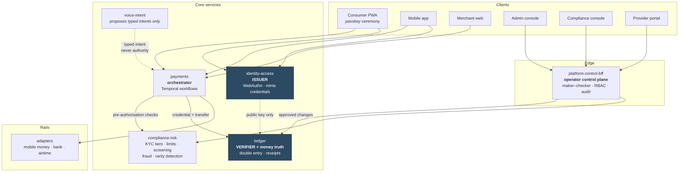
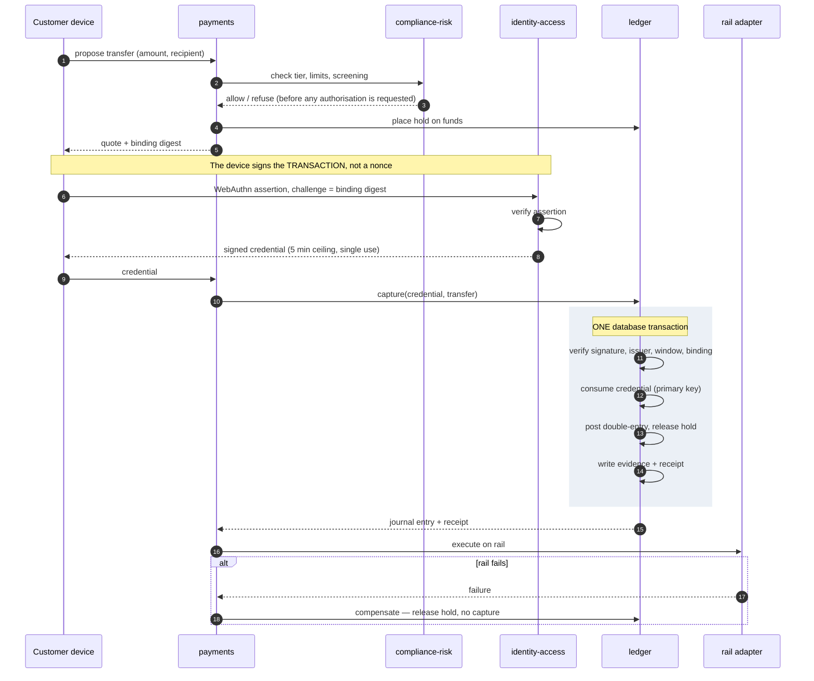
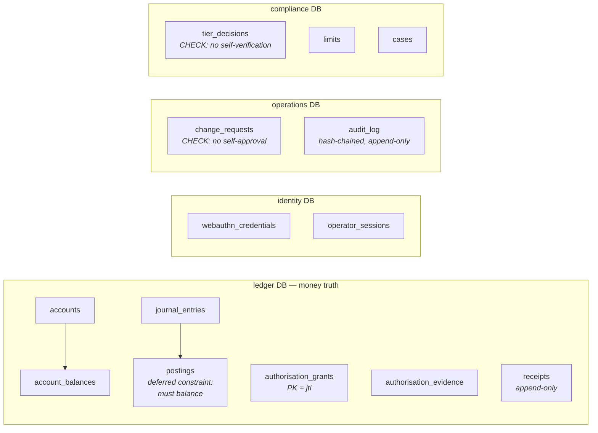
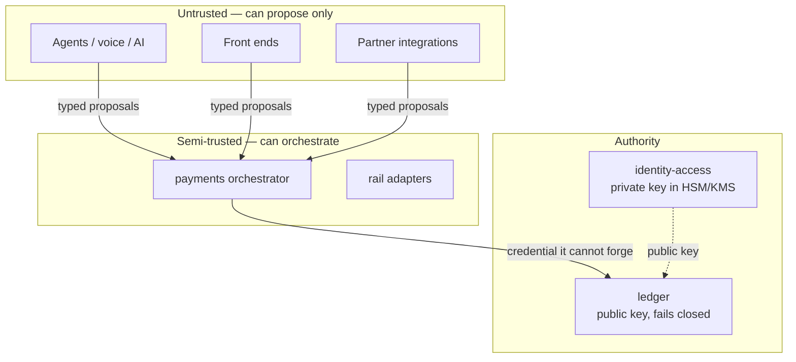
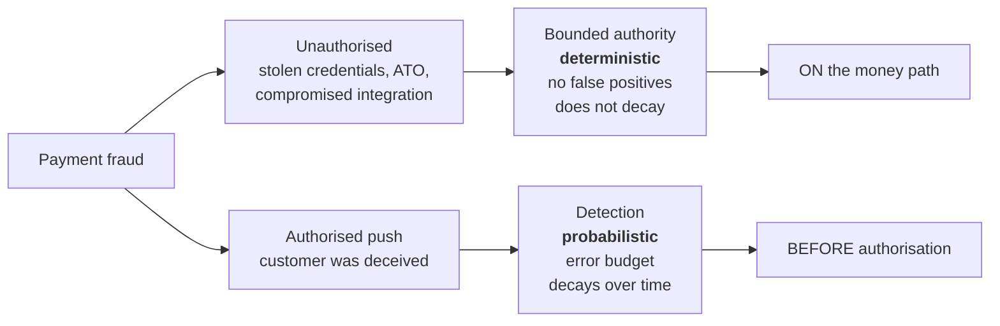

# EPHERA — system architecture

A UK–Ghana corridor payments platform, designed so that the properties a
regulator, a sponsor bank or an acquirer will ask about are **structural** rather
than procedural.

This document is the architecture as built. Where something is designed but not
yet implemented, it says so in §10 rather than being drawn as though it exists.

---

## 1. The organising principle

Most payment platforms are organised around *features*. This one is organised
around a single boundary:

> **Authority to move money is a verifiable credential, not a permission.**

Everything else follows. Once authority is a signed, transaction-bound,
single-use credential verified at the point money moves, three things become true
at once, and none of them require anyone to behave well:

- A compromised internal service cannot move money, because it cannot produce a
  credential.
- A non-deterministic component — an agent, a voice interface, a partner
  integration — can safely *propose* payments, because proposing is all it can
  do.
- Every movement of money has an unforgeable record of who authorised it and for
  exactly what.

That last point is the commercial one. It converts "we have good controls" into
"here is the cryptographic evidence, verify it yourself."

### The three rules the whole system enforces

| Rule | Enforced by |
| --- | --- |
| The **ledger** is the only authority for balances. No UI, cache, provider response or admin console may set one | Double-entry constraints in the database; no write path exists elsewhere |
| **Authority is a credential.** Bound to one transaction, spent once, verified where money moves | `boundedauth` + primary key consumed in the posting transaction |
| **AI proposes; it never authorises.** No model output can release funds | Typed intents; the money path contains no model |

---

## 2. System view

**Read the dotted lines.** `identity-access` never calls the ledger — it
publishes a public key. `voice-intent` produces a typed intent and nothing else.
Neither can move money, by construction rather than by policy.

**Eight deployables, not a microservice sprawl.** Six Go services, a worker, and
the client applications. The boundaries are drawn where *authority* differs, not
where a team might want its own repository.

---

## 3. The critical path: one payment

This is the sequence that everything else exists to protect.

**The shaded block is the whole architecture in one place.** Verification,
consumption, posting, evidence and receipt commit together or not at all. There
is no window in which a replayed credential can post, and no state in which money
moved but the authority for it did not.

**Step ordering is a security property.** Compliance runs *before* the customer
is asked to authorise, so a refused payment never consumes the customer's
authorisation. Binding verification runs *before* consumption, so presenting a
credential against the wrong transaction refuses it without burning it.

---

## 4. Service responsibilities

| Service | Owns | Must never |
| --- | --- | --- |
| **ledger** | Balances, double-entry postings, holds, authorisation verification, consumption records, receipts | Accept an unverified authorisation; expose any balance-write path |
| **identity-access** | WebAuthn registration and assertion, credential minting, the only private key | Mint without a completed authenticator ceremony |
| **payments** | Transfer lifecycle, Temporal workflows, rail selection, compensation | Post money; its opinion of a credential authorises nothing |
| **compliance-risk** | KYC/KYB/KYA tiers, limits, screening, monitoring, fraud scoring, rarity detection | Let a customer decide their own tier; sit on the money path |
| **platform-control-bff** | Operator authentication, RBAC, maker–checker, hash-chained audit | Allow self-approval; permit a balance edit |
| **voice-intent** | Natural language → typed intent | Emit anything other than a proposal |
| **adapters** | Provider rails, HMAC-signed, replay-protected | Hold general-purpose credentials |

### Why the ledger verifies, and not the gateway

A verification at the API edge is bypassed by every internal caller. The entire
threat model assumes internal services can be compromised, so the check belongs
at the point where the irreversible thing happens. If the ledger has no public
key configured it refuses **every** transfer — the failure of omission is a
refusal.

---

## 5. Data architecture

**Separate databases per authority domain**, so a compromise of the compliance
service does not grant write access to balances.

**The invariants live in the database, not only in application code**, because
application code is what an attacker replaces:

- Double entry — a deferred constraint trigger; an unbalanced journal entry
  cannot commit
- Single use — a primary key, not a `SELECT`-then-`INSERT`
- No self-approval — a `CHECK` constraint, in addition to the application check
- Append-only audit and receipts — `BEFORE UPDATE OR DELETE` triggers that raise

---

## 6. Security architecture

| Control | Mechanism |
| --- | --- |
| Authorisation | Ed25519 over a length-prefixed transaction digest; 5-minute ceiling enforced at mint **and** verify |
| Device binding | WebAuthn assertion where **the challenge is the binding digest** |
| Replay | `jti` consumed in the same transaction as the postings |
| Repointing | Refused *before* consumption, so an observer cannot burn a credential |
| Operator access | Passkeys only — no password exists in the operator path |
| Privileged change | Maker–checker in code and in a database constraint |
| Audit | Hash-chained, append-only, enforced by trigger |
| Kill switch | **Fails closed** — unreachable control plane stops payments |

### What this does not defend against

Stated because a diligence reader will find it anyway: a compromised **issuer**
can mint authority for anything — the WebAuthn-challenge design reduces this but
does not eliminate it. A compromised **host** can perform effects with no
credential, which is why verification sits at the ledger. There has been **no
third-party penetration test**.

---

## 7. The two fraud controls, and why they are separate

This split is the most defensible idea in the platform. A signature cannot
distinguish a deceived customer from a happy one, so detection is genuinely
necessary — but a probabilistic control on the money path means refusing
legitimate payments on a score, with no signature to appeal to.

Measured on 590,540 real transactions
([study](research/bounded-authority-study.md),
[notebook](../notebooks/fraud-detection-ieee-cis.ipynb)):

| | Bounded authority | Detection |
| --- | --- | --- |
| Latency | 3.11 ms p50 | asynchronous |
| Throughput | ~21,000/s (saturating) | n/a |
| False positives | none possible | budgeted; 1% review → 24.5% of fraud caught |
| Time dependence | none | recall at fixed capacity fell ~⅓ across the held-out period |

---

## 8. Operational architecture

- **Workflow durability** — Temporal for the transfer lifecycle, so a crash
  mid-payment resumes rather than stranding funds. Compensation is designed, not
  improvised: a failed rail releases the hold and does not capture.
- **Kill switches** fail closed, per control.
- **Alerting distinguishes** binding mismatch (attack), replay (attack), bad
  signature (forgery or key rotation error), expiry (ordinary). Collapsing these
  into one metric makes attacks invisible inside routine noise.
- **Detector self-protection** — the fraud detector monitors its own behaviour,
  not its accuracy, because production has no labels. **Both** over-flagging and
  going quiet trigger fallback to a known-good configuration. A detector that has
  silently stopped detecting looks exactly like a calm week.
- **Migrations** are versioned with SHA-256 checksums and drift detection.

---

## 9. Why this is defensible commercially

**The authorisation layer is separable and sells on its own.** It is extracted as
[`boundedauth`](../modules/boundedauth): zero dependencies, a normative
specification, cross-language test vectors, and a **conformance suite that tests
the adopter's implementation** — the property everyone gets wrong. Three
independent implementations pass it, including EPHERA's own ledger, which is
judged by the same suite an outside adopter would run.

That is unusual. Most security guidance ends at "implement this carefully." This
ends at a command that returns non-zero.

**The evidence is runnable.** `./scripts/verify-trust-claims.sh` — 19 checks,
which print what they do *not* verify on every run.

**The failures are in the repository.** Gate reports record what went wrong,
including mistakes made while fixing things. A platform whose documentation
contains no mistakes is either very young or not telling you everything.

---

## 10. Maturity — what is real, what is not

| Area | Status |
| --- | --- |
| Ledger, double entry, holds, receipts | Built, tested against a real database |
| Bounded authority + conformance suite | Built; 3 implementations pass; vectors reproduced in a second language |
| Passkey payment, browser | **Demonstrated end to end** with a real WebAuthn ceremony |
| Passkey payment, **mobile device** | **Not yet.** Needs an Expo development build |
| Operator console, maker–checker, audit | Built and demonstrated with two operators |
| Compliance tiers, limits, screening | Built. **Screening list is a fixture**, not a licensed list |
| Fraud detection | Built; benchmarked. **Accuracy unmeasured** — no labelled production data |
| Provider rails | **Simulated.** No live provider integration |
| Console/portal reads | Partly **in-memory seed data** |
| Service-to-service auth | **Shared token**, not mTLS or workload identity |
| Live funds, production credentials, real customer data | **None, ever** |
| Third-party penetration test | **None** |

---

## 11. What money buys next, in order

1. **A real device completing a passkey payment** — closes the largest gap
   between what is demonstrated and what a sponsor will ask for.
2. **Third-party penetration test and code audit** — the one claim that cannot
   be self-certified.
3. **A live provider integration** behind the existing fail-closed connector
   interface.
4. **Sponsor/EMI conversation**, carrying the evidence pack rather than a deck.
5. **`boundedauth` as a product** — spec and verifier open, issuer and
   evidence retention commercial.
